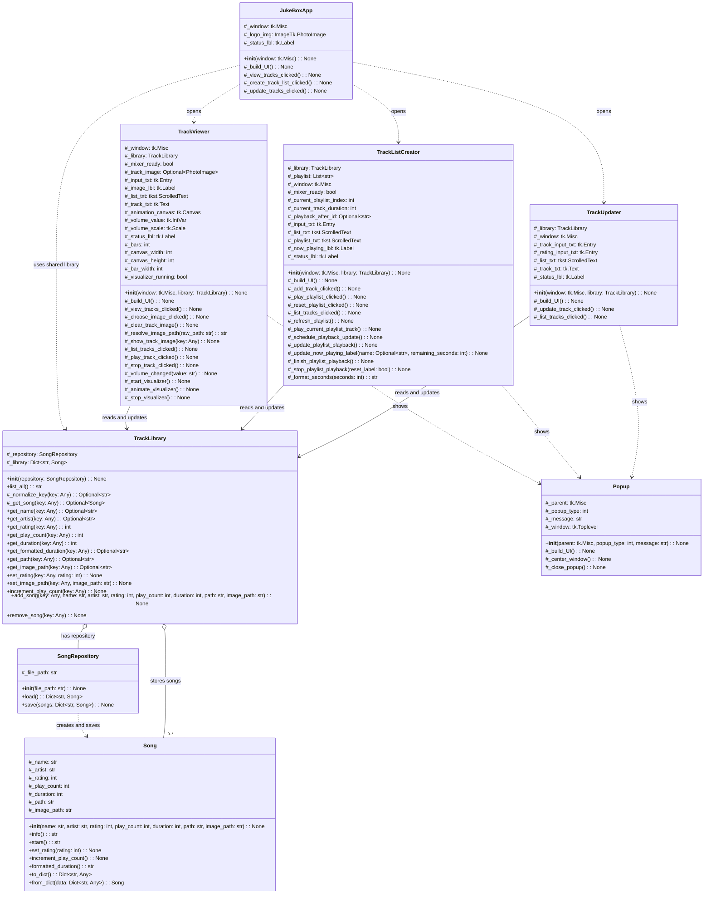

# Jukebox Project Class Diagram

## Relationship Summary

- `Song` is the data object for one track. Its state is protected, and public methods expose behavior such as rating updates, play count updates, duration formatting, and CSV conversion.
- `SongRepository` loads and saves `Song` objects from `assets/song.csv`. Its file path is protected because only the repository should use it directly.
- `TrackLibrary` is the main public service API. UI classes call its public getter/update methods instead of accessing songs directly.
- `JukeBoxApp` is the dashboard window. Its UI widgets and button callbacks are protected implementation details.
- `TrackViewer`, `TrackListCreator`, and `TrackUpdater` are Tkinter UI classes that receive and use the same `TrackLibrary` object. Their widget state, callbacks, and playback helpers are protected.
- `Popup` is a reusable notification window. Its window state and close callback are protected implementation details.

## Notes

- `+` means public and `#` means protected.
- No double-underscore private members are used because Python projects usually reserve `__private` for name-mangling cases.
- Types are inferred from constructor values, return values, and Tkinter/Pygame usage because the Python source does not declare type hints.
- Module-level helpers such as `_build_library()` and `_set_text()` are not modeled as classes.
